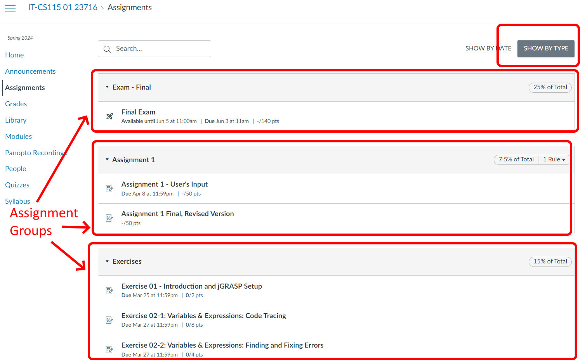

[PASTE_SNIPPET_INTO_FRONTMATTER](../../snippets/frontmatter/homework_assignment.yaml)

## You are not allowed to work in groups this assignment
Reminder: For this assignment, you should start, finish, and do all the work on your own.  If you have questions, please contact the instructor.

 

## **Purpose**

This assignment is intended to give everyone practice writing a program that utilizes repetition / iteration and reviews the prior topics covered in this course.

## **Learning outcomes**

-   Learn: Build basic programs in an appropriate programming language
-   Learn: Participate in exercises (in-class and/or online) designed to develop an understanding of object oriented programming
-   Think: Develop expertise in techniques and approaches to independently fix bugs in program source code
-   Think: Develop and apply computer science knowledge in order to construct solutions to foundational programing problems
-   Think: Demonstrate an intuitive understanding of each programming language construct
-   Communicate: Clearly document problem solutions
-   Communicate: Use written, spoken, and symbolic forms to convey concepts creatively

## **Tasks**

Write a program to implement a grade calculation system that is loosely based on the grading schema for this course.

## **Directions**

For this assignment you\'ll create a program that asks the user to type in their grades, and then calculates part of their overall, quarter-long GPA.  This program isn\'t going to calculate the GPA for this course (IT-CS 115), but you\'re welcome to extend the program to do so if you wish.

*In order to get full credit on this assignment you must use loops (repetition / iteration) where possible to eliminate redundant code. * Remember - if you\'re copying and pasting (or pasting almost-but-not-quite identical code) then you should look for a way to use a loop to repeat the actions instead!

### How does Canvas organize assignments?

The first thing to understand is that Canvas organizes grades up into \"Assignment Groups\", which you can see by clicking on the [Assignments]($../../snippets/inline/CANVAS_COURSE_REFERENCE.md$/assignments "Assignments"){course-type="navigation" api-endpoint="https://cascadia.instructure.com/api/v1/courses/2572351/assignments" api-returntype="[Assignment]"} link here in Canvas, and then asking Canvas to \"Show By Type\" in the upper-right corner.  You can then see the different Assignment Groups.  In this picture it lists an Assignment Group labeled \"Exam - Final\" that contains a single thing - the Final Exam.  The next Assignment Group is named \"Assignment 1\", and it contains two items - \"Assignment 1 - User\'s Input\" and \"Assignment 1 Final, Revised Version\".  For the purposes of this assignment (the one that you\'re working on right now) we\'re going to ignore the revision just to keep things simple(r).  The last Assignment Group is a labeled \"Exercises\" and has three items listed, each with different point values (in this case they\'re worth 2 points, 8 points, and 4 points).

You\'ll notice that Canvas also assigns percentages to each Assignment Group.  In this example the \"Exam-Final\" group is worth 25% of the total points, the \"Assignment 1\" group is worth 7.5%, and all of the Exercises are collectively worth 15%.  NOTE: This is just an example - we will be using slightly different numbers for the homework assignment that you\'re working on right now.

{role="presentation" width="1036" height="638"}

### What percentages should you use?

For the homework assignment that you\'re working on right now you will use the following schema to determine grades.  Note that this may or may not accurately represent this IT-CS 115 course that you\'re currently enrolled in:

-   First Assignment Group: Exam #1 is worth 25% of the overall grade
-   Second Assignment Group: Exam #2 is worth 25% of the overall grade
    -   Both exams contribute a total of 50% of the overall grade
-   Next Assignment Group: Homework assignment #1 is worth 7.5% of the overall grade
-   Assignment Group: Homework assignment #2 is worth 7.5% of the overall grade
-   Assignment Group: Homework assignment #3 is worth 7.5% of the overall grade
-   Assignment Group: Homework assignment #4 is worth 7.5% of the overall grade 
    -   All four homework assignments contribute a total of 30% of the overall grade
-   Assignment Group: This assignment group contains five in class exercises.  This group (containing all the ICEs) are collectively worth 20% of the overall grade

### Calculating the overall grade as a weighted total

The key to calculating the grades here in Canvas is explained in the first paragraph of [How do I weight the final course grade based on Assignment Groups?](https://community.instructure.com/en/kb/articles/660669-how-do-i-weight-the-final-course-grade-based-on-assignment-groups), which says \"You can weight final grades based on [assignment groups](https://community.canvaslms.com/t5/Instructor-Guide/How-do-I-add-an-assignment-group-in-a-course/ta-p/970). Selecting this option assigns a weight to each assignment group, not the assignments themselves. Within each assignment group, a percentage is calculated by dividing the total points a student has earned by the total points possible for all assignments in that group\". 

Let\'s look at the first two sentences from the above quote - \"You can weight final grades based on [assignment groups](https://community.canvaslms.com/t5/Instructor-Guide/How-do-I-add-an-assignment-group-in-a-course/ta-p/970){target="_blank"}. Selecting this option assigns a weight to each assignment group, not the assignments themselves.\"  If we start by looking at the exams and homework assignments this will be easier since each assignment or exam \"group\" has a single item in it.

You can [find more information about how weighted grades work and how to calculate them online](https://calculatorcentral.com/grade-calculators/weighted-grade-calculator/){.inline_disabled target="_blank"},  The key formula is:

Weighted Grade = (w1 x g1 + w2 x g2 + w3 x g3 + ...) / (w1 + w2 + w3 + ...)

The first \'Assignment Group\' is the picture above is \'Exam-Final\' and it\'s weight is 25%.  So w1 is 0.25.  Let\'s say that the grade you got on the final exam was 90% , also written as g1 = 0.9.  We can then plug those two numbers into the formula to get:

Weighted Grade = ([**0.25 x 0.9**]{style="background-color: #fff500;"} + w2 x g2 + w3 x g3 + ...) / ([**0.25**]{style="background-color: #fff500;"} + w2 + w3 + ...)

The second Assignment Group pictured above is \'Assignment 1\'.  We\'ll ignore the revision in your program.  Let\'s say that you got 87% of the points, and \'Assignment 1\' is worth 7.5% of the points overall. That would give us:

Weighted Grade = (0.25 x 0.9 + [**0.075 x 0.87**]{style="background-color: #fff500;"} + w3 x g3 + ...) / (0.25 + [**0.075**]{style="background-color: #fff500; color: #000000;"} + w3 + ...)

 

#### We can simplify the denominator (the bottom part) if the weights all sum to 1 (to 100%)

It\'s worth noting that if w1 (the first weight) is 25% but we write it as 0.25, and the next weight is the same (so w2 is 0.075), then if we add up all the weights they should equal 1.  In other words, w1 + w2 + w3 + ... = 1, which means that we can ignore the denominator if our weights all total up to 100%.  

``` {style="padding-left: 40px;"}
```

### Calculating the percentage within an Assignment Group

We will need to use a slightly different approach for the \'Exercises\' Assignment Group. 

Look at last sentence of the quote above - \"Within each assignment group, a percentage is calculated by dividing the total points a student has earned by the total points possible for all assignments in that group\". In other words, if an Assignment Group here in Canvas has more than 1 assignment within it (such as the \'Exercises\' category within the [Assignments]($../../snippets/inline/CANVAS_COURSE_REFERENCE.md$/assignments "Assignments"){course-type="navigation" api-endpoint="https://cascadia.instructure.com/api/v1/courses/2572351/assignments" api-returntype="[Assignment]"} for this course) then you need to sum up all the points that you\'ve earned in that category and divide that total by the sum of all the possible points in that category.

For example, if the there are 5 in class exercises and they are worth 2, 8, 4, 17, and 12 points respectively (note: these numbers may or may not be accurate for this course for this quarter) and you get 2, 8, 4, 15, and 11 points respectively, then you can figure out the percentage of points for the overall category by adding up your scores (2 + 8 + 4 + 15 + 11 = 40) and dividing by the total possible points (2 + 8 + 4 + 17 + 12 = 43) to get 40 / 43 = 0.930\....  In other words, you got 93.0% of the possible in class exercise points.

## Example Transcript:

Here\'s an example how the program should run.  Your program should produce the same output, and [**it\'s critical that the program accepts the same inputs, in the same order**]{style="background-color: #fff500;"} as this example transcript shows.

Note that user input is in [***bold, italics, and green highlight***]{style="background-color: #bfedd2;"}.  This provides one example of what the user might type in, but your program must work for anything the user types in.

Also note that I\'ve added in some Java-style comments to explain a couple of things.  Your program is NOT supposed to print these out. These comments are [underlined and red highlighted]{style="text-decoration: underline; background-color: #f8cac6;"}.

    Welcome to the grade calculator!
    How many points were available for Exam #1?
    100
    How many points did you get for Exam #1?
    90
    You got 90.00% of the points on this Exam
    Your grade contributed 22.50% of your overall, quarter-long grade // This is 90/100=0.9 * 0.25 = 0.225
    How many points were available for Exam #2?
    150
    How many points did you get for Exam #2?
    128
    You got 85.33% of the points on this Exam
    Your grade contributed 21.33% of your overall, quarter-long grade
    Your current overall score is 43.83% (out of 100% available in the entire course)
    === === === // 43.83% is the previous total of 22.5% + this new number of 21.33% = 43.83
    How many points were available for Assignment #1?
    50
    How many points did you get for Assignment #1?
    45
    You got 90.00% of the points on this assignment
    Your grade contributed 6.75% of your overall, quarter-long grade
    How many points were available for Assignment #2?
    17
    How many points did you get for Assignment #2?
    15
    You got 88.24% of the points on this assignment
    Your grade contributed 6.62% of your overall, quarter-long grade
    How many points were available for Assignment #3?
    23
    How many points did you get for Assignment #3?
    22
    You got 95.65% of the points on this assignment
    Your grade contributed 7.17% of your overall, quarter-long grade
    How many points were available for Assignment #4?
    50
    How many points did you get for Assignment #4?
    50
    You got 100.00% of the points on this assignment
    Your grade contributed 7.50% of your overall, quarter-long grade
    Your current overall score is 71.87% (out of 100% available in the entire course)
    === === ===
    How many points were available for ICE1? // Notice that we do something slightly different here
    2                                        // We total up the available points and points actually gotten
    How many points did you get for ICE1?    // and then we calculate the percentage 
    2
    How many points were available for ICE2?
    8
    How many points did you get for ICE2?
    8
    How many points were available for ICE3?
    4
    How many points did you get for ICE3?
    4
    How many points were available for ICE4?
    10
    How many points did you get for ICE4?
    9
    How many points were available for ICE5?
    10
    How many points did you get for ICE5?
    10
    === === === // gotten points = 2 + 8 + 4 + 9 + 10  = 33; available points = 2 + 8 + 4 + 10 + 10 = 34
    You got 97.06% of the points on the in class exercises // 33 / 34 = 0.9705882... All numbers are rounded off to 2 digits after the decimal place
    Your in class exercise grades contributed 19.41% of your overall, quarter-long grade
    Your current overall score is 91.29% (out of 100% available in the entire course)
    === === ===

## Recommended Approach:

1.  Start with the exams because there\'s only 2 of them
    A.  Write out code to ask the user for information about a single exam.  **Make sure it works correctly - check your answers by hand!**
    B.  Copy and paste for the second exam, then verify that it\'s working correctly by hand
    C.  Comment out this first version of the two exams (so that you can refer back to this working code if you need to) and replace it with a loop that asks for an exam, twice.  Verify answers by hand
    D.  Make sure that you\'re printing out \"Exam #1\" and \"Exam #2\" while still using the loop (instead of something generic like \"Next exam\" for each exam)
2.  Repeat steps for the exams, but this time for the homework assignments.\
    Because each homework assignment is worth 7.5% of the points we can use the same approach that we used for exams
3.  The third major part are the In Class Exercises.  These are slightly different because you\'ll need to sum up the possible points for each ICE along with the actual number of points that were obtained for that exercise.  Once you\'ve gotten the total of each then (and only then) can you calculate the overall percentage for the category, which you can then use to calculate the category\'s contribution to the weighted grade overall.

## Simplifications:

-   Notice that for this program the user types in their grade for each assignment.  For this program there are no revisions to assignments (so your program does not have to figure out which one is higher).
-   You can assume that the user types in numbers (you don\'t have to check for errors if they type in text instead of a number)
-   You can assume that that the user will type in a number of points that they got for each item that is between 0 and the maximum available points for that assignment.  In other words, `0 <= actual points <= max points`.

## **Submission**

Submit your program file through Canvas.

Remember to always [Make Sure That You Submitted The Correct File(s) For Your Homework!](../../pages/course_orientation/how-to-make-sure-that-you-submitted-the-correct-file-s-for-your-homework.md "How To Make Sure That You Submitted The Correct File(s) For Your Homework")

## **Grading Criteria**

This assignment is worth 50 points. Your work will be graded using the attached rubric.
