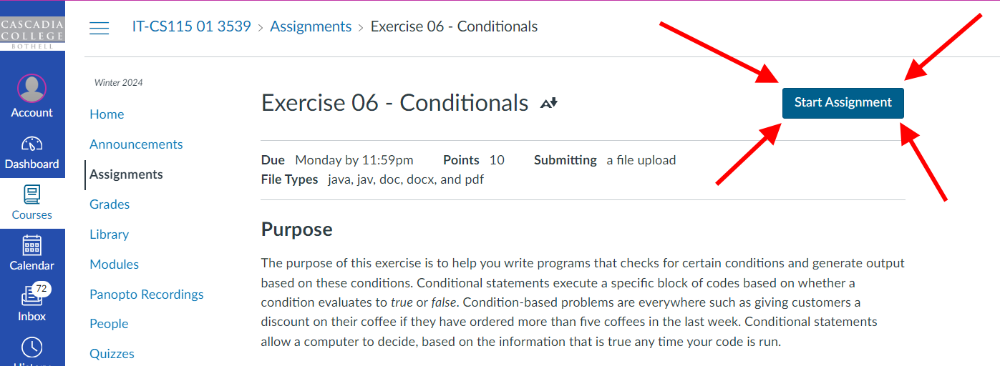
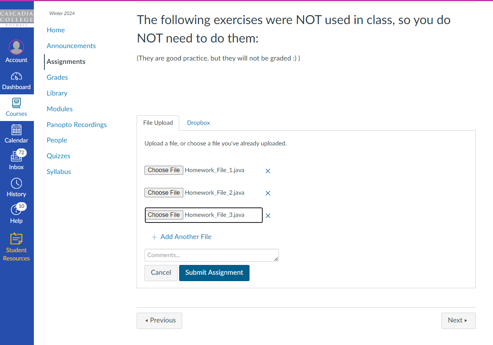
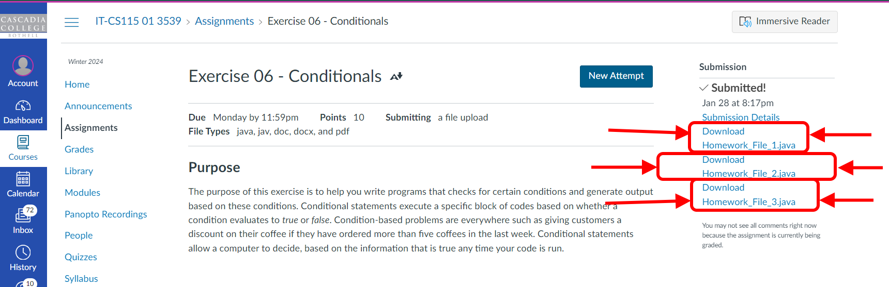

I strongly recommend that you always make sure that you\'ve uploaded the correct file before your work is graded.  Double-checking that you\'ve done everything correctly is always a good step to take, whether you\'re solving a math problem, submitting your resume to a job you\'re applying for, or uploading your homework to be graded. 

Here\'s how you can check that you\'ve uploaded the correct homework file in Canvas.

1.  **First, you go to the Assignment page here in Canvas and click on \'Start Assignment\':**\
    {#239821515 role="presentation" width="776" height="284"}\
    \
    \
2.  **Next, choose the files you want to upload, within the \'File Upload\' tab near the bottom of the Assignment:**\
    {role="presentation" width="679" height="476"}\
    \
3.  **Once you\'ve uploaded all the files you want to upload you should then click on \'Submit Assignment\'**\
    \
4.  **At this point Canvas will reload the Assignment page and confirm that you\'ve uploaded the files**\
    In addition to all the prior information Canvas will now list your Submission in the right-most column of the page.\
    In  that right-most \'Submission\' column Canvas will tell you that the assignment has been submitted (with the text \'Submitted!\', and below the \'Submission Details\' link you will have a link to download each of the files that you uploaded.\
    [**At this point you should visually confirm that you\'ve handed in all the files that you need to hand in**]{style="background-color: #fff500;"} - if you\'re missing any of the files that contain any work that you want the instructor to grade then you should click on \'New Attempt\' and upload all the files again.\
    \
5.  **Next, you should confirm that each file that you uploaded actually contains the work that you want the instructor to grade.**\
    **[Do this by clicking on the download link for each and every file, downloading the file, opening the file, and confirming that the file contains the work you wanted to upload.]{style="background-color: #fff500;"}**{role="presentation" width="978" height="317"}**[\
    ]{style="background-color: #fff500;"}**
    A.  These links read \"Download \<filename\>\", so if you uploaded a file named \"Homework_File_1.java\" then you\'ll see a link named \"Download Homework_File_1.java\".
    B.  When you click on the link Canvas and your web browser will let you download the file.  \
        You can download the file anywhere you want, but remember that this is an \'extra\' copy that you\'re just checking to see if it\'s the right one.  Specifically, you don\'t want to accidentally work on this extra copy in the future (for example, if you revise your work later).
        -   One solution is to create a folder on your Desktop (say) and name it DELETEME, and then only put files into the DELETEME folder that you\'re ok deleting.  This temporary file is a perfect DELETEME file - as soon as you\'re done looking at it you can safely delete it.
        -   Remember, never do any work on any of the files in your DELETEME folder!
        -   Also, feel free to delete all the files in your DELETEME folder (or even delete the entire folder and create a new one the next time you need a DELETEME folder).
    C.  Once you\'ve downloaded the file you should open the file and read through it, and confirm that it contains all the most recent work for your homework.
    D.  Once you\'ve confirmed that this file is ok you can delete it and repeat this process for the next file, and then the one after that, until you\'ve checked all the files you uploaded.\
        \
6.  **If any of the files are missing work then you need to click on the \'New Attempt\' button and upload the files that contain the missing work**

