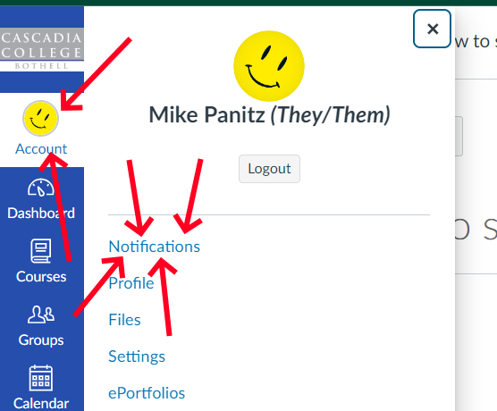
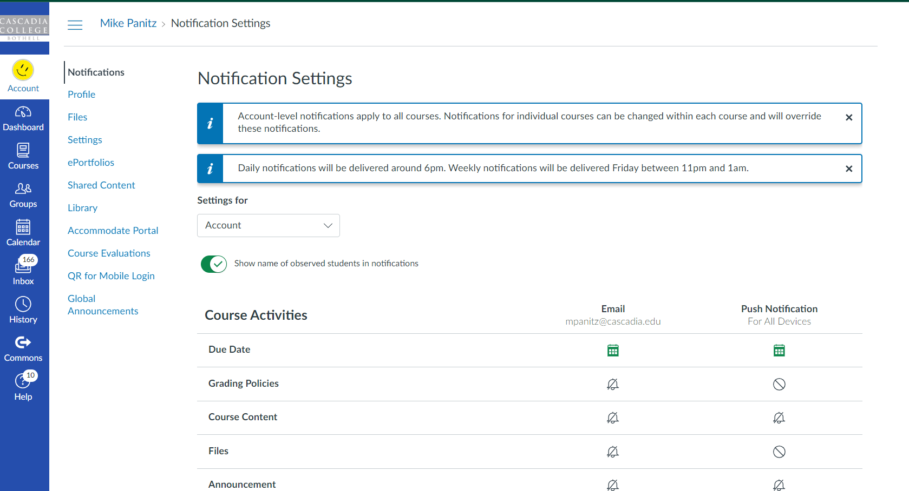
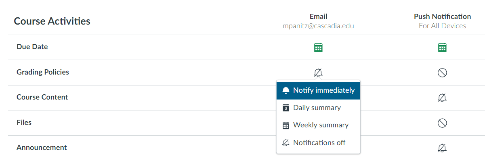
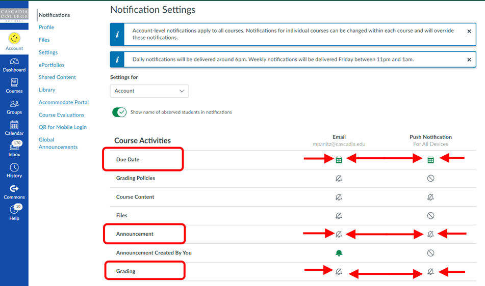

 

First, you need to click/tap on \'Account\' in the left-most column (for Canvas overall, not the column that\'s specific to this course).  A panel will slide out with \'Notifications\' as the top link, as pictured here:

{style="display: block; margin-left: auto; margin-right: auto;" width="556" height="460"}

This will open up a page that lets you set up your notifications.  Some notes:

1.  You can set up a phone number to get text messages at (these are sometimes called \"SMS Messages\")
2.  You can set up separate notifications for your email and your phone.  This is good for sending high-priority notifications to both places, and then send longer and/or lower-priority messages to email.

The page will look something like this (note that details, such as when messages are delivered may be different for you)

{style="display: block; margin-left: auto; margin-right: auto;" width="1003" height="543"}

 

You can change a setting by clicking on the icon in that setting\'s row, under the column for the communication mechanism (Email or phone).  You then have several options for delivery.

-   For very import stuff I recommend \'Notify Immediately\'.
-   You can also ask for a single message each day, which contains all the notifications for this category - this is the \"Daily Summary\" option
-   I do NOT recommend the Weekly Summary - if there\'s an exam on Thursday (say) and the instructor posts an Announcement on Monday (say) then you might not get it until after the exam (currently Canvas is saying it\'ll send out weekly emails on Friday evenings, but in the past they\'ve sent emails Saturdays late at night).

{style="display: block; margin-left: auto; margin-right: auto;" width="1003" height="332"}

 

It is recommended that you set up Notifications to be \"Immediately\" for the following categories:

-   Due dates\
    I think this will notify you when you\'re close to a due date
-   Announcement\
    If class is unexpectedly canceled (e.g., due to weather) you\'ll want to get the Announcement Immediately
-   Grading\
    When the instructor posts a grade you\'ll be notified Immediately, so you can see the grade and read your feedback

Here\'s an image that shows where to click:

{width="951" height="562"}

