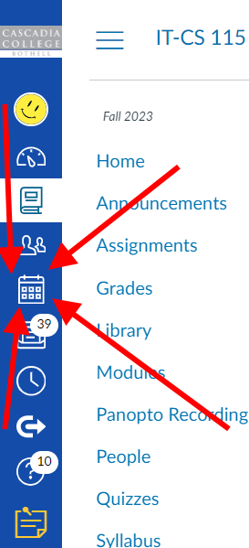
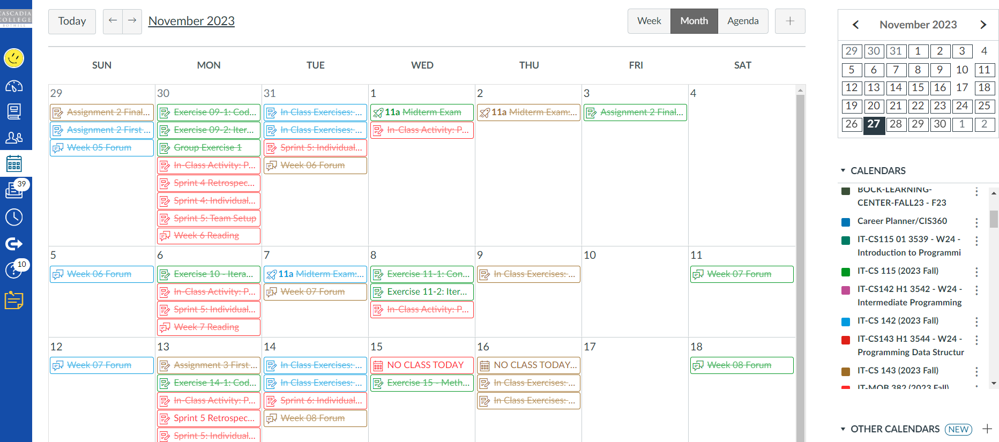
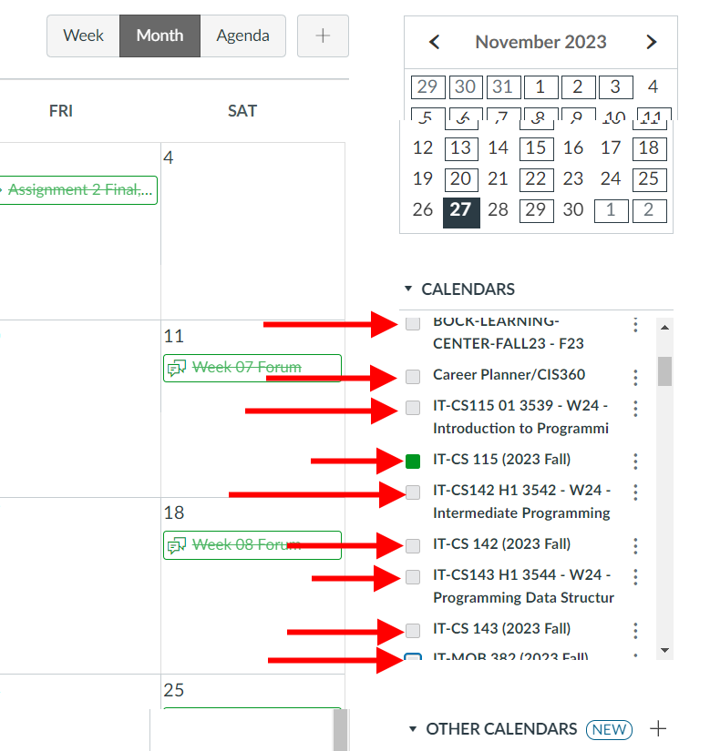
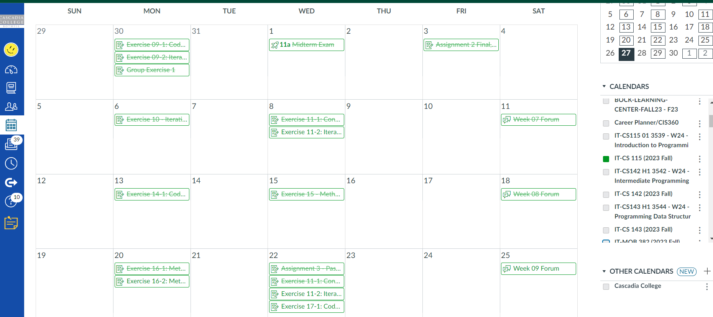

I strongly recommend that you keep track of due dates for this class using the Calendar feature here in Canvas.  The \'Canvas Calendar\' is a great place to get a clear, intuitive view of all the due dates (both past and present).  At the same time, it can be overwhelming to see ALL the due dates that Canvas normally presents you with.

This page will explain how to find and view the Canvas Calendar, and how to remove most of the due dates so that you can focus on one class\'s due dates at a time.

You can find a link to the Canvas Calendar in the left-most column of icons here in Canvas:

At this point you\'re probably looking at a wall of appointments, and probably feeling a bit overwhelmed:

{style="display: block; margin-left: auto; margin-right: auto;" width="543" height="236"}

At this point the key is step to [**making the calendar useful to you is to turn off all the calendars except the one for this class**]{style="text-decoration: underline;"}. 

You can do that by clicking on the small, color-coded squares in the bottom-right panel.  

{style="display: block; margin-left: auto; margin-right: auto;"}

 

Once you\'ve done that you should see only the due dates for this one class (and any events the instructor has added (no promises, but sometimes I add events for days where there\'s no classes because of holidays or in-service days, etc). For example:

{style="display: block; margin-left: auto; margin-right: auto;"}(Your calendar may look different than mine - Canvas crosses out Assignments that I\'ve finished grading which is why some of the Assignments are crossed out)

 

You can repeat this trick for your other classes - you can check off that one other class, UN-check everything else, and then Canvas will show you the due dates for that one other class.

 

