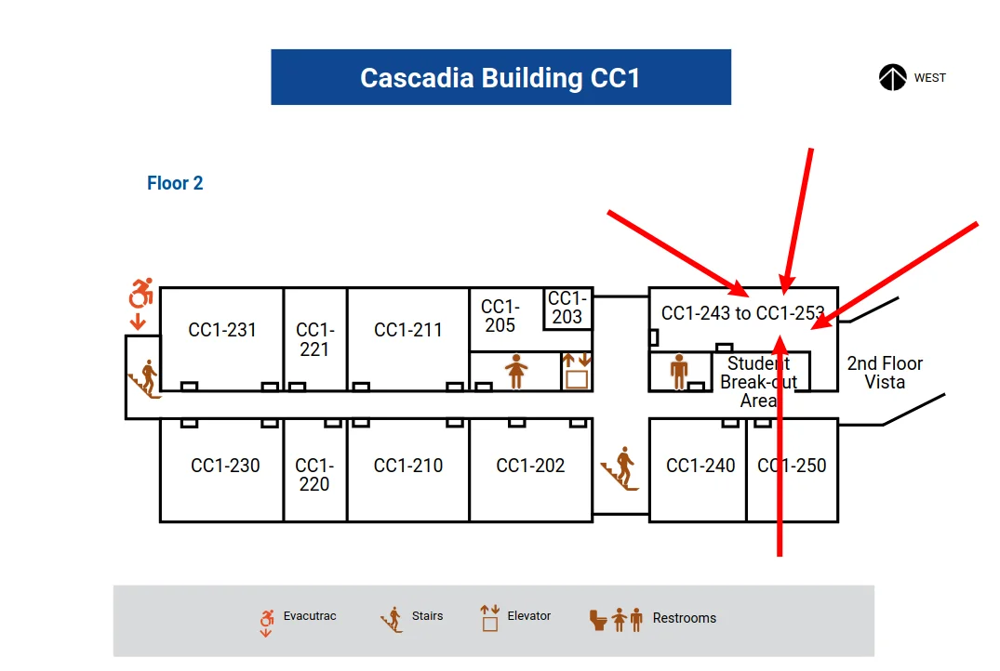

## What?

Please come to student office hours if you need help, have questions, and or just want to talk together outside of class. I am here to help you! 

- Student office hours will be drop-in, meaning you can come in any time in the times listed on [the main page for this course]($../snippets/inline/CANVAS_COURSE_REFERENCE.md$).\
  If you cannot come in those times, please ask me for an appointment for another day or time.

## When?

- Office hours are listed on [the main page for this course]($../snippets/inline/CANVAS_COURSE_REFERENCE.md$)

## Where?

- My office is [OFFICE NUMBER](../snippets/inline/office_number.md)
- You can choose to drop by in person, or you can join my Zoom call ([See Zoom Details here](zoom-links.md))
- 
- 

 
